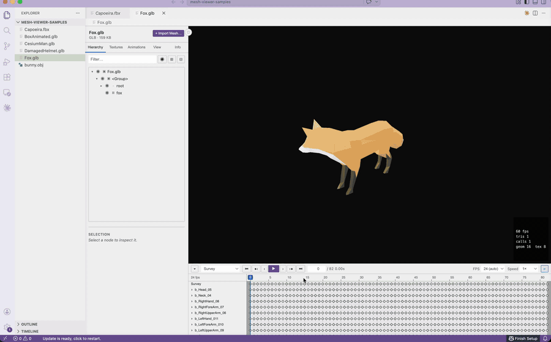
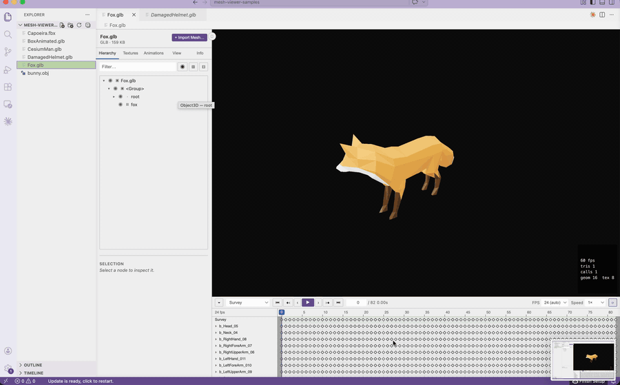

# 3D Mesh Viewer

A VS Code / Cursor extension that turns the editor into a fully featured **3D mesh viewer**. Open any supported 3D file (GLB, GLTF, FBX, OBJ, USD/USDZ, STL, PLY, DAE, 3MF, …) and get an interactive Three.js viewport with a scene-hierarchy tree, per-object inspector, a Blender-style animation timeline / dope sheet with frame-by-frame playback, drag/drop mesh import, and a rich file-info panel — all inside a custom editor.

Install it from the VS Code Marketplace or Open VSX (search "3D Mesh Viewer"), or grab the `.vsix` from this repo's [Releases](../../releases).

## Inspect any mesh

Click a 3D file and it opens right in the editor: orbit/pan/zoom the PBR-lit viewport, browse the scene hierarchy, toggle visibility per node, inspect materials and textures, and check triangle/draw-call stats in the live HUD.

## Animation playback with timeline

Skinned and keyframed assets get a Blender-style dope sheet: pick a clip, scrub the playhead, step frame-by-frame, and control playback speed and looping. Bone/joint markers follow the animated skeleton.

## More features

- **Wide format support** — GLB/GLTF, FBX, OBJ, USD/USDA/USDC/USDZ, STL, PLY, DAE (Collada), 3DS, 3MF, VRML, and more
- **Scene hierarchy** — tree view with filtering, per-node visibility (with a one-click bulk show/hide of the filtered set), and selection outlines
- **Inspector** — object transforms, geometry stats, material and texture details
- **Skin-weight visualization** — recolor a skinned mesh by its bone weights, with modes for all bones, a single isolated bone, influence count, and weight normalization; the coloring deforms with the animation
- **View options** — wireframe overlay, skeleton overlay, grid/axes helpers, bounds, environment lighting, and a Y-up / Z-up axis toggle for CAD/robotics assets exported Z-up
- **Drag & drop import** — merge extra meshes into the current scene
- **Remembers your view settings** — shading, grid, background, and other view toggles carry over to the next file you open, and persist across restarts
- **Performance HUD** — FPS, triangle count, draw calls, memory

See [DOCS.md](DOCS.md) for supported formats, features, usage, configuration, commands, development setup, and troubleshooting.

## License

MIT — see the `LICENSE` file in this repository.
