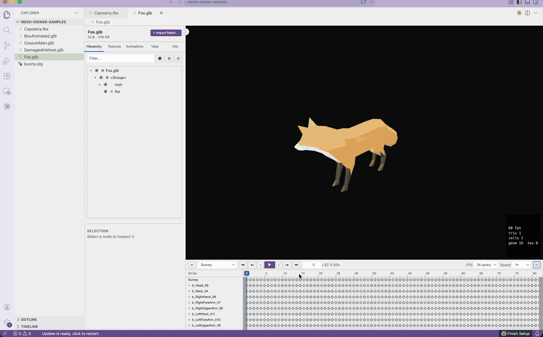
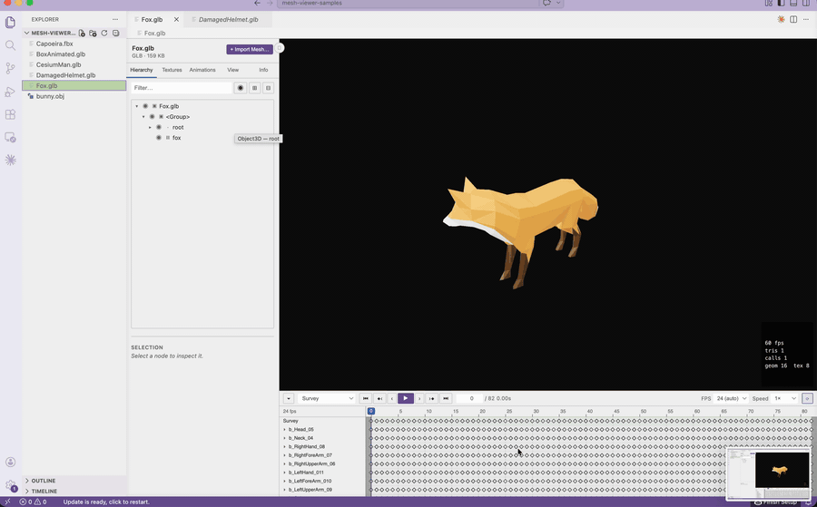
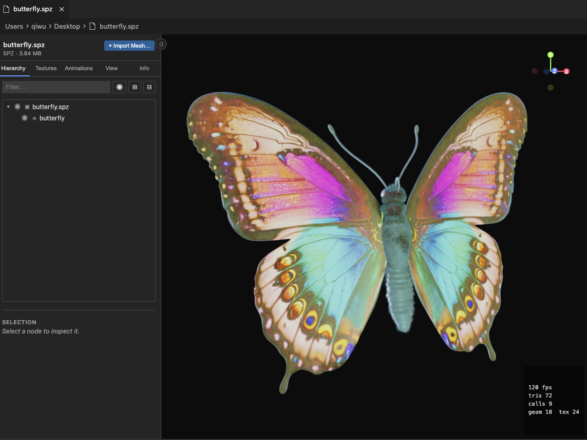
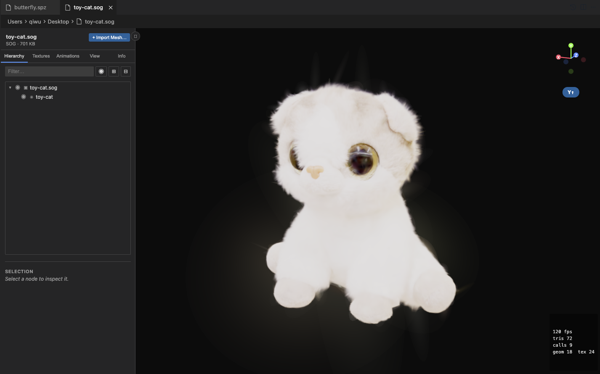
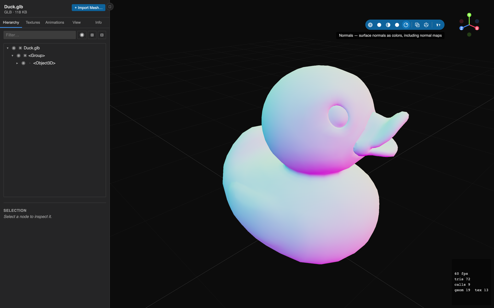

# 3D Mesh Viewer

A VS Code / Cursor extension that turns the editor into a fully featured **3D mesh viewer**. Open any supported 3D file (GLB, GLTF, FBX, OBJ, USD/USDZ, STL, PLY, DAE, 3MF, …) — or a **Gaussian splat** capture (SPZ, SPLAT, KSPLAT, SOG, 3DGS PLY) — and get an interactive Three.js viewport with a scene-hierarchy tree, per-object inspector, a Blender-style shading HUD, an animation timeline / dope sheet with frame-by-frame playback, drag/drop mesh import, and a rich file-info panel — all inside a custom editor.

Install it from the VS Code Marketplace or Open VSX (search "3D Mesh Viewer"), or grab the `.vsix` from this repo's [Releases](../../releases).

## Inspect any mesh

Click a 3D file and it opens right in the editor: orbit/pan/zoom the PBR-lit viewport, browse the scene hierarchy, toggle visibility per node, inspect materials and textures, and check triangle/draw-call stats in the live HUD.

## Animation playback with timeline

Skinned and keyframed assets get a Blender-style dope sheet: pick a clip, scrub the playhead, step frame-by-frame, and control playback speed and looping. Bone/joint markers follow the animated skeleton.

## Gaussian splatting

3D Gaussian splat captures render right in the viewer via [Spark](https://sparkjs.dev), alongside the mesh formats. `.spz`, `.splat`, `.ksplat`, and `.sog` open directly, and `.ply` files are sniffed by header so both original 3DGS and PlayCanvas-compressed exports route to the splat renderer automatically. Camera framing, grid alignment, and the bounds helper all work as usual, and a one-click **Flip splats upright** toggle handles Y-down captures.

## Blender-style shading HUD

A shading strip next to the corner view gizmo switches between **Wireframe, Solid, Material, Rendered, and Normals** modes, with composable **X-ray** and **Flat shading** toggles (like Blender's Alt+Z) and the **Y↑/Z↑ up-axis** switch folded into the same strip — each button with instant hover explanations. Material mode previews the asset's materials under a pinned neutral environment; Rendered uses your chosen environment; Normals visualizes shader normals including the material's normal maps.

## More features

- **Wide format support** — GLB/GLTF (including DRACO- and meshopt-compressed, and KTX2/Basis textures), FBX, OBJ, USD/USDA/USDC/USDZ, STL, PLY, DAE (Collada), 3DS, 3MF, VRML, Gaussian splats (SPZ/SPLAT/KSPLAT/SOG/3DGS PLY), and more
- **Sidecar textures** — FBX/OBJ/DAE files that reference textures by relative path (e.g. a `textures/` folder next to the model) load them automatically, even when the exported absolute paths are stale
- **Scene hierarchy** — tree view with filtering, per-node visibility (with a one-click bulk show/hide of the filtered set), and selection outlines
- **Inspector** — object transforms, geometry stats, material and texture details
- **Skin-weight visualization** — recolor a skinned mesh by its bone weights, with modes for all bones, a single isolated bone, influence count, and weight normalization; the coloring deforms with the animation
- **Blendshape controls** — a Blendshapes tab (shown only when a scene has morph targets) with a slider per shape, grouped by mesh and optionally combined by name for ARKit face rigs; sliders track animated shapes live and let you pose them by hand
- **View options** — wireframe overlay, skeleton overlay, grid/axes helpers, bounds, environment lighting, and a Y-up / Z-up axis toggle for CAD/robotics assets exported Z-up (also one click away in the shading HUD)
- **Measurement** — a bottom-left scale bar for the current zoom, plus a ruler tool to click two points and read the distance
- **Drag & drop import** — merge extra meshes into the current scene
- **Snapshot** — export the current view to a PNG (camera button in the shading HUD, or a command)
- **Remembers your view settings** — shading, grid, background, and other view toggles carry over to the next file you open, and persist across restarts
- **Performance HUD** — FPS, triangle count, draw calls, memory

See [DOCS.md](DOCS.md) for supported formats, features, usage, configuration, commands, development setup, and troubleshooting.

## License

MIT — see the `LICENSE` file in this repository.
